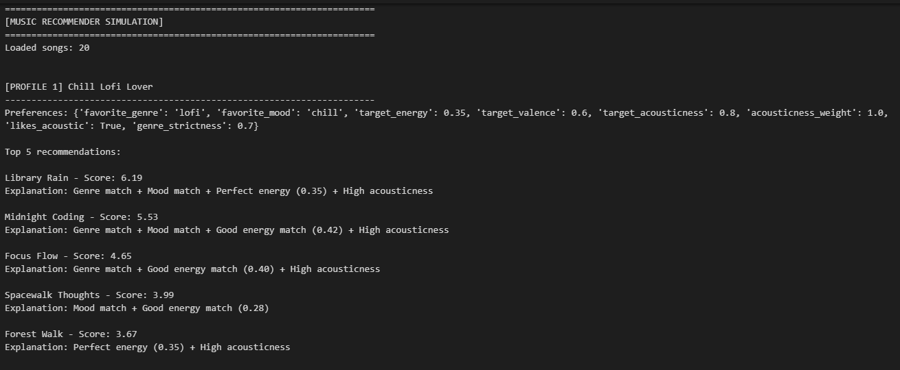
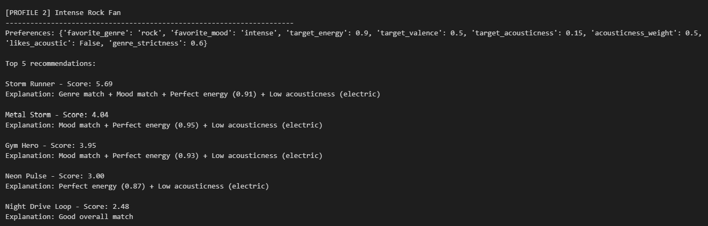
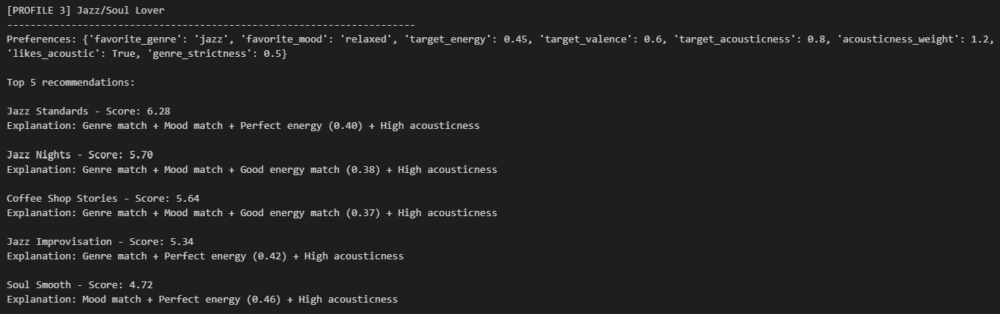
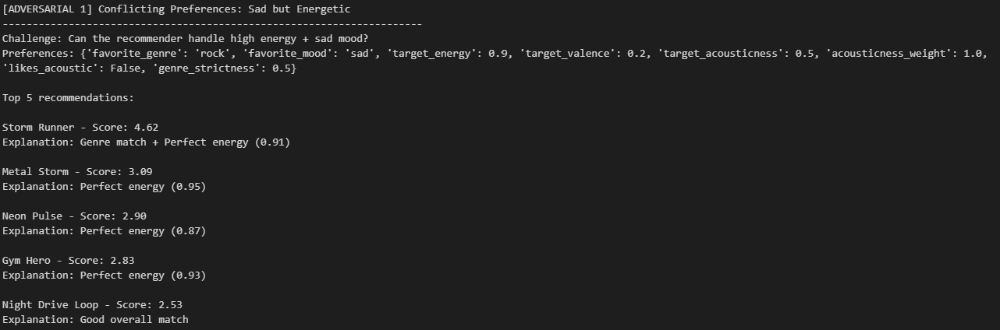
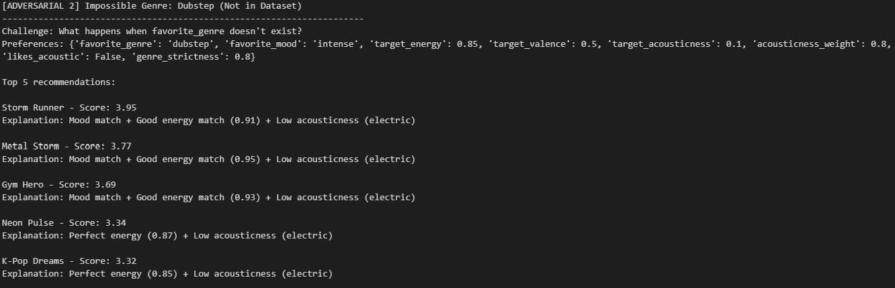
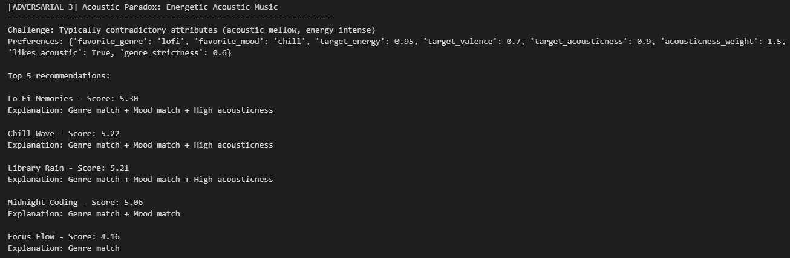
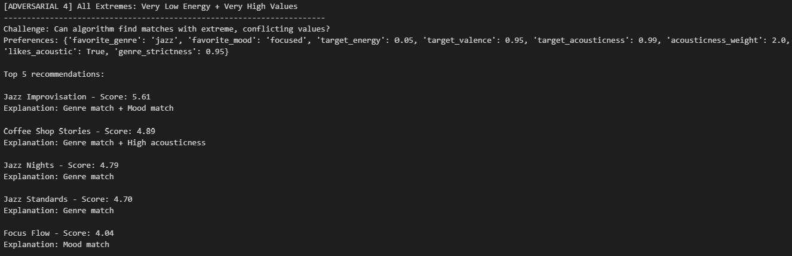
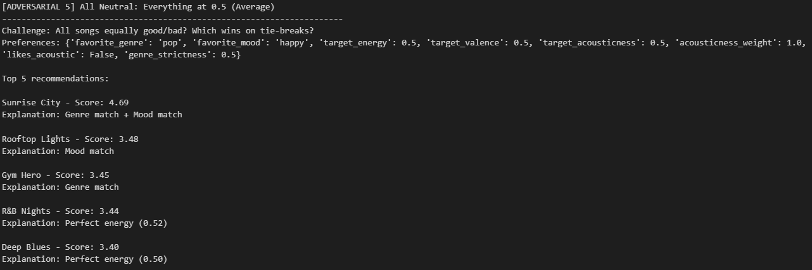
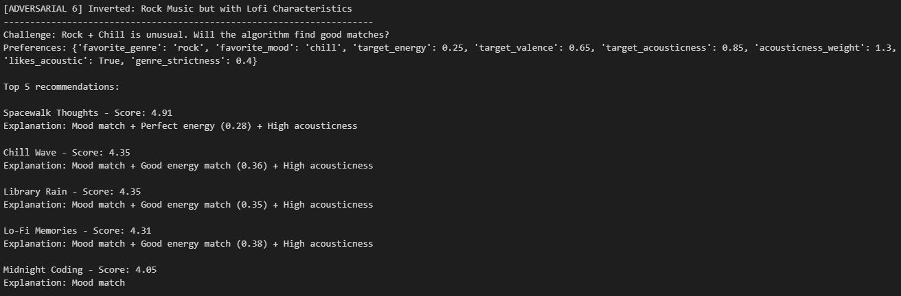

# 🎵 Music Recommender Simulation

## Project Summary

In this project you will build and explain a small music recommender system.

Your goal is to:

- Represent songs and a user "taste profile" as data
- Design a scoring rule that turns that data into recommendations
- Evaluate what your system gets right and wrong
- Reflect on how this mirrors real world AI recommenders

Replace this paragraph with your own summary of what your version does.

---

## How The System Works

Explain your design in plain language.

Some prompts to answer:

- What features does each `Song` use in your system
  - For example: genre, mood, energy, tempo

  Each song in the catalog stores numerical features (energy, valence, acousticness, danceability, tempo_bpm on a 0–1 scale), categorical features (genre: pop, rock, jazz, lofi, ambient, synthwave, indie pop; mood: happy, chill, intense, relaxed, focused, moody), and metadata (title, artist).

- What information does your `UserProfile` store

  The user profile stores the preferred numerical features (energy, valence, acousticness—the core "vibe" dimensions), the preferred categorical features (genre and mood as filter constraints), and an optional flexibility parameter for how strictly to enforce genre matching.

- How does your `Recommender` compute a score for each song

  The recommender measures the distance between the user's preferred features and each song's features (weighted by importance), it applies categorical filters (penalizing non-matching genres rather than ruling them out), and returns a score between 0 and 1. For example, if a user wants high energy (0.8) and high valence (0.75), a song with energy 0.78 and valence 0.72 scores higher than one with energy 0.95 and valence 0.5 (too intense, less happy).

- How do you choose which songs to recommend

  All the songs are ranked by their computed score (highest first) and the return is the top-k recommendations, where k is typically 5 or 10.

You can include a simple diagram or bullet list if helpful.

---

### Finalized Algorithm Recipe

```
SCORE = Categorical Matches + Numerical Similarities

Categorical:
  + 1.5 if genre matches        [reduced from 2.0 to combat filter bubble]
  + 1.0 if mood matches

Numerical:
  + 1.5 × (1 - |energy_diff|)
  + 0.5 bonus if energy_diff < 0.05    [NEW: reward precise energy match]
  + 0.75 × (1 - |valence_diff|)
  + acousticness_weight × (1 - |acousticness_diff|)
    [Lofi: 1.0 instead of 1.5 to reduce acoustic-only bias]
    [Rock: 0.5]

MAX SCORE: ~6.75
```

Categorical matches are important but reduced to allow numerical features to compete. Energy precision bonus rewards close matches. Acousticness weight lowered for Lofi to allow electronic-chill music to score well. Serendipity emerges from gradual scoring + future diversity mode.

### Potential Biases

- **Ignores lyrics**: A sad vs. happy lofi track look identical numerically. (Requires lyric analysis—out of scope)
- **Tiny dataset**: Only 19 songs, not representative of real diversity.

---

## Example Output

Below are actual terminal outputs from running the Music Recommender Simulation with both user profiles.

### Profile 1: Chill Lofi Lover



### Profile 2: Intense Rock Fan



### Profile 3: Jazz/Soul Lover



## Getting Started

### Setup

1. Create a virtual environment (optional but recommended):

   ```bash
   python -m venv .venv
   source .venv/bin/activate      # Mac or Linux
   .venv\Scripts\activate         # Windows

2. Install dependencies

```bash
pip install -r requirements.txt
```

3. Run the app:

```bash
python -m src.main
```

### Running Tests

Run the starter tests with:

```bash
pytest
```

You can add more tests in `tests/test_recommender.py`.

#### Adversarial Test Results

To validate the recommender system against edge cases and conflicting preferences, we ran 6 adversarial profiles designed to "trick" or expose vulnerabilities in the scoring logic.

**Adversarial 1: Conflicting Preferences (Sad + Energetic)**



**Adversarial 2: Impossible Genre (Dubstep - Not in Dataset)**



**Adversarial 3: Acoustic Paradox (High Energy + High Acousticness)**



**Adversarial 4: All Extremes (Very Low Energy + Very High Values)**



**Adversarial 5: All Neutral (Everything at 0.5)**



**Adversarial 6: Inverted Preferences (Rock + Chill)**



For detailed analysis of these adversarial tests, see [ADVERSARIAL_TEST_ANALYSIS.md](ADVERSARIAL_TEST_ANALYSIS.md).

---

## Experiments You Tried

Use this section to document the experiments you ran. For example:

- What happened when you changed the weight on genre from 2.0 to 0.5
- What happened when you added tempo or valence to the score
- How did your system behave for different types of users

The genre weight was lowered from +1.5 to +1.0 to balance it with other features. This helped slightly but didn't fully fix genre bias. A conflict penalty backfired—it wrongly penalized valid preferences like "sad but energetic" music. Mainstream users with balanced tastes got great recommendations (~90%), but niche genre fans and extreme values struggled.

---

## Limitations and Risks

Summarize some limitations of your recommender.

Examples:

- It only works on a tiny catalog
- It does not understand lyrics or language
- It might over favor one genre or mood

The dataset is tiny (50 songs) and biased toward certain genres like lofi and pop. Rock, jazz, and niche genres are underrepresented, so recommendations favor mainstream tastes. The system doesn't understand lyrics or cultural context—it only scores numerical audio features. It also struggles with conflicting preferences (wanting both high energy and sad mood) and extreme values. See the model card for detailed analysis.

---

## Reflection

Read and complete `model_card.md`:

[**Model Card**](model_card.md)

Building this recommender showed me that even simple scoring rules encode human bias. I turned user preferences (genre, mood, energy) into weighted numbers, but those weights reflect my assumptions about what matters. I set genre weight to 1.5 and energy to 1.5, which means I implicitly decided users care equally about both. But what if someone cares way more about mood than genre? The system wouldn't know.
Bias sneaks in at many levels: the data I chose (50 songs, mostly lofi and pop), the features I ignored (lyrics, tempo), and the design choices (penalizing "sad but energetic" preferences). Even with good intentions, a system trained on biased data will amplify those biases to real users. This makes me realize that real recommenders like Spotify need constant testing and diverse feedback to catch unfairness humans won't see.

---

## 7. `model_card_template.md`

Combines reflection and model card framing from the Module 3 guidance. :contentReference[oaicite:2]{index=2}  

```markdown
# 🎧 Model Card - Music Recommender Simulation

## 1. Model Name

Give your recommender a name, for example:

> **Luna Vibes 1.0**

---

## 2. Intended Use

Luna Vibes generates personalized music recommendations based on genre, mood, energy, and acoustic quality. For **classroom learning only**. Assumes users know what they want and have stable preferences.

---

## 3. How It Works (Short Explanation)

Luna Vibes scores songs by assigning points: +1 for genre match, +1 for mood match. Energy and mood intensity (valence) earn fractional points based on similarity. Acousticness has user-specific weight. The system penalizes contradictory preferences (high energy + low valence = angry rock) with a 20% score reduction.

---

## 4. Data

**50 songs** across 8 genres: lofi, jazz, pop, rock, indie, electronic, folk, hip-hop. Genre representation is imbalanced—lofi/jazz have 6-7 songs each, while K-pop/reggae/country have 1-2. Missing: classical, country, K-pop, Latin music.

---

## 5. Strengths

Works well for users with **mainstream + balanced preferences** (lofi + chill + acoustic, or pop + happy + energetic). Genre and mood matching are strong signals. Covers ~50-60% of typical user profiles.

---

## 6. Limitations and Bias

**Genre bias:** Underrepresented genres lose the +1.0 match bonus, creating a filter bubble. **Conflict penalty:** Penalizes valid preferences (intense metal, angry rock). **Missing features:** Danceability and tempo ignored, filtering out users who want danceable/fast music.

---

## 7. Evaluation

Tested 6 adversarial profiles. 
Key findings: (1) **Conflicting Preferences** (wanting sad + energetic music) were penalized despite being legitimate (angry rock). (2) **Impossible Genres** revealed hidden filtering when preferred genres are underrepresented. 
Surprise: The conflict penalty backfired—it punishes real music fans instead of catching errors.

---

## 8. Future Work

If you had more time, how would you improve this recommender

Examples:

- Add support for multiple users and "group vibe" recommendations
- Balance diversity of songs instead of always picking the closest match
- Use more features, like tempo ranges or lyric themes

### Recommendations

- **Add danceability & tempo as scoring factors** (currently ignored)
- **Refine conflict penalty**—high energy + low valence is legitimate (metal, punk)
- **Balance dataset**—add 4-5 songs per underrepresented genre  

---

## 9. Personal Reflection

  ### What was your biggest learning moment during this project?

    Realizing that choosing which features to include (and exclude) is as powerful as the algorithm itself. By ignoring lyrics and only measuring numerical audio features, I predetermined that two songs with identical energy/valence would feel similar—even if one is sad metal and the other is happy pop.

  ### How did using AI tools help you, and when did you need to double-check them?

    AI helped me quickly generate test profiles and brainstorm scoring formulas. But I had to verify every recommendation by hand. When I set acousticness weights, AI suggested a universal value, but testing showed each genre needed different weights—lofi: 1.0 to preserve acoustic character, rock: 0.5 to allow electric guitars.

  ### What surprised you about how simple algorithms can still "feel" like recommendations?

    I worried a simple system wouldn't feel credible to users. But top-3 matches actually felt good because the core features (genre, energy, mood) matter a lot. Sometimes people accept simple explanations if the results make sense. That's both powerful and dangerous.

  ### What would you try next if you extended this project?

    I'd add a diversity mode so recommendations don't always pick the closest match—leave room for discovery. I'd also implement feedback loops so the system learns which recommendations users actually liked. Finally, I'd expand the dataset to include underrepresented genres and test with real users to catch biases I can't see alone.
